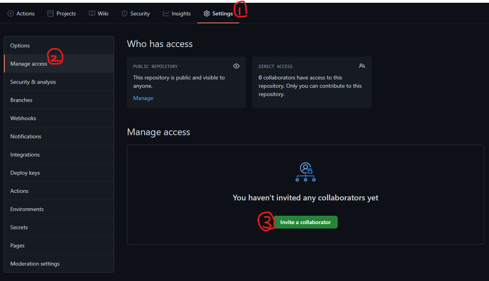

# 1. git 명령어

-git pull origin master

-> push 전에는 pull이 있다.

-git restore --staged {file}: add를 취소한다. Staging Area에 있는 것을 

​											  Working Directory로 다시 옮긴다.

-git restore {file}: Working Directory에 변경된 사항을 이전 Commit으로 되돌린다. 

​							   (내 시간도 사라진다.)

-git reset : 이미 Commit 된 상태에서 이전으로 돌아간다.

-reset으로 바뀌는 부분

| option | WD   | SA   | RP   |
| ------ | ---- | ---- | ---- |
| Soft   | x    | x    | o    |
| Mixed  | x    | o    | o    |
| Hard   | o    | o    | o    |

- o : 과거의 Commit 모습으로 돌아간다.
- x : 현재 내가 작업하고 있는 모습이 그대로 남아있다.

-git ignore : git 이 해당파일에 대한 버전관리를 하지 않으며 무시한다.

- *.(확장자) : 해당 확장자의 파일을 모두 무시한다.
- (디렉토리명)/ : 해당 디렉토리의 파일을 모두 무시한다.
- (파일명).(확장자) : 해당 파일을 무시한다.

-[gitignore 파일 생성 사이트](https://www.toptal.com/developers/gitignore)

# 2. git collaboration

-초대할 사람의 github 아이디를 입력하고 초대한다.

-crew는 merge 할 때 master에게 Pull Request(PR)을 보냄

# 3. 브랜치(Branch)

-특정 커밋을 가리키는 '포인터'

-git branch : branch 목록 확인

-git checkout {branch name} : 브랜치 이동

-git branch -d {branch name} : 브랜치 삭제

-git merge (합쳐지는 branch name) : 브랜치를 합치는 것

-git log --graph : 브랜치를 그래프로 보여줌

-git log --graph --oneline : 그래프를 한줄로 보여줌

## 1) Work flow

-git을 활용하여 협업하는 흐름. 브랜치를 활용한 전략

- git flow : 브랜치를 크게 5개로 나누어 개발한다.
  				(정해진 답은 없다. 가이드라인 정도)

  - Shared Repository Model
  - Fork & Pull Model

   -> 두 모델의 차이는 작업자가 해당 프로젝트 저장소에 직접적인  push 권한이 있는지 여부이다.
  
  

# 4. Github Pages

# 5. Conflict 상황

